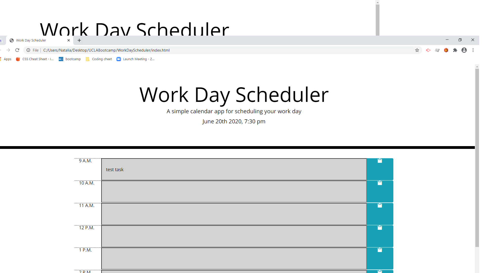

# Work Day Scheduler Starter Code

### This is a simple calander application that allows users to save events for hours 9am-5pm. 
#### It's built with 
* HTML
* CSS
* Java
#### Powered by 
* Bootstrap
* jQuery
* Moment.js

[GitHub repository link]https://github.com/natka58/Work-Day-Scheduler)

[Live Link](https://natka58.github.io/Work-Day-Scheduler/)
